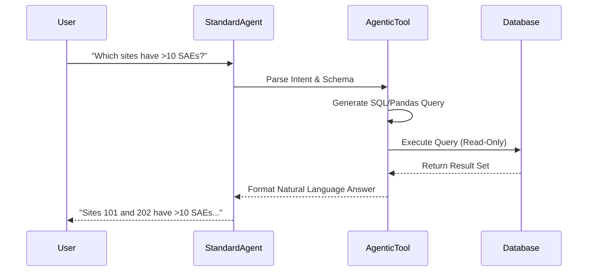
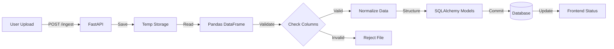

# System Design Document: ClinicalFlow

## 1. Executive Summary
ClinicalFlow is designed as a modular, loosely coupled system that separates the *Presentation Layer* (React) from the *Logic/Data Layer* (FastAPI/SQLite). The core architectural goal is **responsiveness and transparency**—users should always know the state of their data, whether it's being ingested, analyzed, or reported.

## 2. Architecture Overview

### High-Level Architecture
```mermaid
graph TD
    User([Clinical Lead]) -->|HTTPS/Interact| UI[Frontend: React + Vite]
    
    subgraph "Presentation Layer"
        UI -->|State| Store[React Context]
        UI -->|Route| Views[Pages: Monitor, Reports]
    end

    UI -->|REST API| API[Backend: FastAPI]

    subgraph "Core Logic Layer"
        API -->|Route Request| Router[API Router]
        Router -->|Process| RiskEng[Analytics Engine]
        Router -->|Process| DocGen[ReportLab PDF Engine]
        Router -->|Process| Agent[AI Agent (LangChain)]
    end

    subgraph "Data Persistence"
        RiskEng -->|Read/Write| DB[(SQLite Database)]
        Agent -- Read --> DB
        Ingest[Data Ingestion] -->|Write| DB
    end

    File[Excel/CSV Data] -->|Upload| Ingest
```

### 3.4 AI Workflow (Agentic)


### 3.5 Data Ingestion Pipeline


## 3. Component Design

### 3.1 Frontend (React + Vite)
- **State Management:**
  - **Local State (`useState`):** Used for UI interactions (modals, tabs, hover states).
  - **Global Context (`App.jsx`):** manages critical session data:
    - `isAuthenticated`: Auth persistence via localStorage.
    - `darkMode`: Theme preference.
    - `reports`: List of generated reports.
- **API Communication:**
  - Standardized usage of `fetch` pointing to `http://127.0.0.1:8000`.
  - usage of `Promise.all` in dashboards for parallel data loading.
- **Styling Strategy:**
  - `Tailwind CSS` with a defined scalable color palette (`slate`, `blue`, `indigo`).
  - `Dark Mode` implemented via CSS variables and the `class` strategy in Tailwind.

### 3.2 Backend (FastAPI)
- **API Layer (`main.py`):**
  - Exposes RESTful endpoints (`GET /stats`, `POST /reports/generate`).
  - Handles logical routing and dependency injection (`get_db`).
- **Data Layer (`database.py`, `models.py`):**
  - **SQLAlchemy ORM** for database abstraction.
  - **Models:**
    - `RiskScore`: Stores calculated risk metrics per site/study.
    - `Study`: Metadata (Status, Phase).
    - `Site`: Granular site details.
    - `Metric`: Raw observational data (SAEs, Queries).
- **Core Interpreters:**
  - `analytics.py`: Encapsulates business logic for calculating "Risk Levels" (High/Medium/Low) based on SAE velocity and missing pages.
  - `reports.py`: Dedicated module for determining PDF layout and content injection using ReportLab.
  - `ingestion.py`: "Extract-Transform-Load" (ETL) pipeline logic.

### 3.3 AI Architecture (Agentic & Generative)
The system employs a dual-mode AI strategy:
1.  **Agentic AI (`agent.py`):**
    -   **Framework:** Built on `LangChain` (logic) and `PandasAI` (data manipulation).
    -   **Mechanism:** Parses natural language (e.g., "Find underperforming sites") into Pandas DataFrame operations.
    -   **Tool Use:** Has direct access to the SQLite database via `read_sql` to answer scientific questions accurately.
2.  **Generative AI (Reporting):**
    -   **Context-Aware Generation:** Injects calculated metrics (DQI scores, High Risk counts) into a structured prompt.
    -   **Output:** Generates executive summaries for PDF reports, synthesizing complex data into narrative form.


## 4. Data Flow

### 4.1 Data Ingestion Flow
1.  **Upload:** User uploads file via `POST /ingest/file`.
2.  **Storage:** File is saved to `backend/uploads`.
3.  **Processing:** `ingestion.py` triggers:
    - Pandas reads the Excel file.
    - Schema validation checks column headers.
    - Data is transformed (normalization).
    - Records are inserted/updated in SQLite `metrics` table.
4.  **Feedback:** Frontend receives "Processing" -> "Complete" status updates via polling or response.

### 4.2 Risk Analysis Flow
1.  **Trigger:** User visits "Risk Monitor".
2.  **Query:** Backend executes a complex aggregation query:
    - `SELECT site_id, COUNT(sae) ... GROUP BY site_id`.
3.  **Logic:** Python computes `Risk Score = (SAE_Weight * count) + (Missing_Weight * count)`.
4.  **Response:** JSON array of sites with calculated risk levels returned to frontend.

## 5. Security & Scalability Considerations
- **Authentication:** Currently implemented as a session-based mock (Dr. Smith). Future: JWT Tokens.
- **Input Validation:** Pydantic models ensure API request bodies match expected schemas.
- **Scalability:**
  - Frontend is static assets (can be served via CDN).
  - Backend is stateless (can be horizontally scaled behind a load balancer).
  - Database is SQLite (embedded) for MVP; easily swappable for PostgreSQL via SQLAlchemy URL change.

## 6. Directory Structure
```
Nest-Assignment/
├── backend/
│   ├── uploads/            # Temporary storage for ingested files
│   ├── main.py             # API Entry point
│   ├── database.py         # DB connection setup
│   ├── models.py           # SQL Tables
│   ├── analytics.py        # Risk Logic
│   └── reports.py          # PDF Generation
├── frontend/
│   ├── src/
│   │   ├── components/     # Reusable UI (Layout, Modal, etc.)
│   │   ├── pages/          # Route Views (Overview, RiskMonitor)
│   │   └── App.jsx         # Root Component & Global State
│   └── tailwind.config.js  # Theme configuration
└── docs/
    └── screenshots/        # Architecture & UI imagery
```
