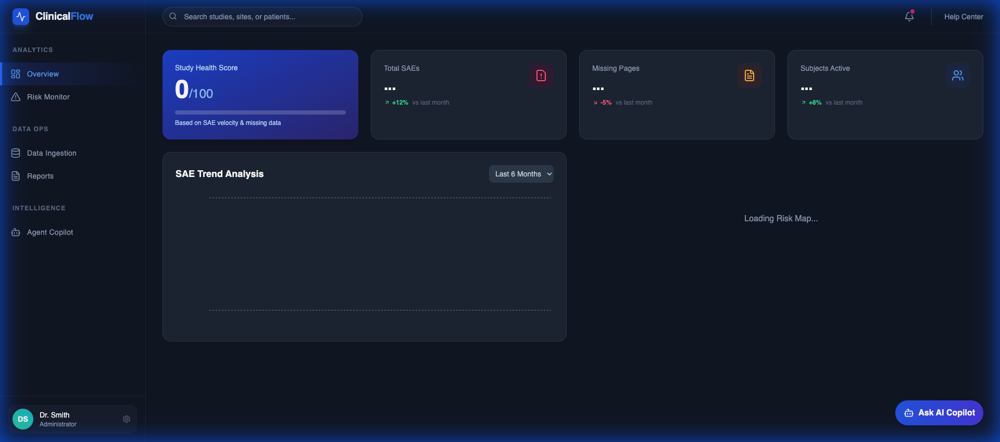
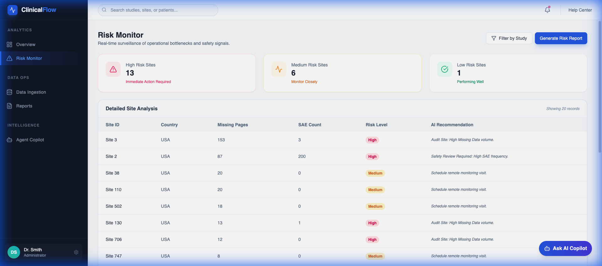
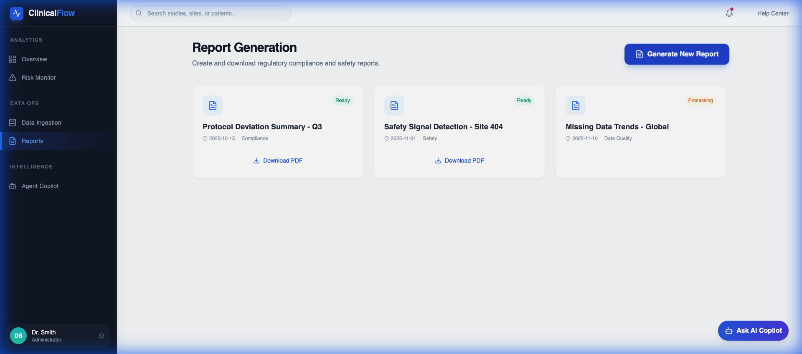
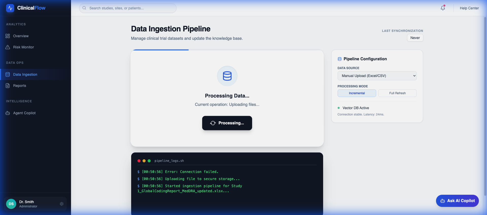

# ClinicalFlow: Intelligent Clinical Trial Risk Monitoring



## 🚀 Overview

**ClinicalFlow** is a next-generation "Insight-Driven Data-Flow Model" designed to revolutionize how clinical trial risks are monitored and mitigated. It moves beyond static dashboards to provide real-time, actionable intelligence through a seamless integration of **Risk Monitoring**, **Automated Reporting**, and **AI-Driven Insights**.

Built for speed, accuracy, and compliance, ClinicalFlow ingests clinical data (EDC, Safety, Lab), analyzes it for risk patterns (SAE velocity, missing data), and empowers clinical leads to take immediate action—all from a single, unified interface.

## ✨ Key Features

- **🛡️ Real-Time Risk Monitor:** Automatically aggregates data from multiple sources to calculate Site Risk Scores.
  - *Visual Heatmaps:* Instantly spot high-risk sites.
  - *Detailed Analysis:* Drill down into SAE counts, missing pages, and query latency.
  - *Actionable Recommendations:* AI-generated next steps (e.g., "Schedule Audit").

- **🤖 Agentic Intelligence Hub (Dr. Smith's Copilot):**
  - Ask natural language questions like *"Which sites have >10 SAEs?"*
  - Receive instant, data-backed answers without writing SQL.

- **📊 Dynamic Reporting Engine:**
  - **One-Click Generation:** Create comprehensive PDF Risk Assessment Reports instantly.
  - **Automated Delivery:** Reports are generated server-side and ready for download.

- **📥 Intelligent Data Ingestion:**
  - Drag-and-drop support for Excel/CSV clinical datasets.
  - Real-time pipeline visualization (Upload -> Schema Validation -> Vectorization).
  - Terminal-style logs for deep transparency.

- **🌑 Premium Dark Mode UI:**
  - Fully responsive, accessible, and theme-aware interface built with Tailwind CSS.
  - Glassmorphism effects and smooth Framer Motion animations.

## 🛠️ Technology Stack

**Frontend:**
- **React 18:** Component-based UI architecture.
- **Tailwind CSS v3:** Utility-first styling with custom dark mode config.
- **Framer Motion:** Smooth, hardware-accelerated animations.
- **Recharts:** Interactive data visualization.
- **Lucide React:** Consistent iconography.

**Backend:**
- **FastAPI:** High-performance async Python web framework.
- **SQLite:** Lightweight, serverless relational database.
- **Pandas:** High-speed data manipulation and analysis.
- **ReportLab:** Programmatic PDF generation.
- **Uvicorn:** ASGI server implementation.

## 📸 Screenshots

### Risk Monitor
*Detailed site-level risk analysis with AI recommendations.*


### Automated Reporting
*Generate and manage PDF risk assessments.*


### Data Ingestion Pipeline
*Transparent, real-time file processing logs.*


## 🚀 Getting Started

### Prerequisites
- Node.js v16+
- Python 3.9+

### backend Setup
```bash
cd backend
python -m venv venv
source venv/bin/activate  # On Windows: venv\Scripts\activate
pip install -r requirements.txt
# Run the server
uvicorn main:app --reload --port 8000
```
*The API will be available at `http://127.0.0.1:8000`*

### Frontend Setup
```bash
cd frontend
npm install
npm run dev
```
*The app will be available at `http://localhost:5173`*

## 🧪 Usage Guide

1.  **Log In:** Use verified credentials (e.g., `dr.smith@clinicalflow.com` / `password`).
2.  **Ingest Data:** Go to **Data Ingestion**, upload a study Excel file, and click "Start Pipeline".
3.  **Monitor Risks:** Check the **Overview** execution metrics and drill down in **Risk Monitor**.
4.  **Generate Report:** On the **Risk Monitor** or **Reports** page, click "Generate Report" to download a full PDF assessment.

---
*ClinicalFlow - Empowering Clinical Trials with Intelligence.*
