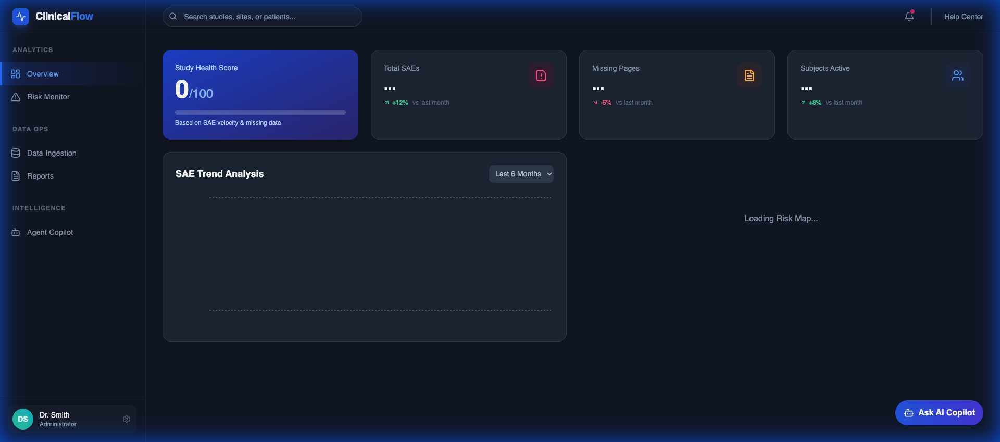

# ClinicalFlow: Intelligent Clinical Trial Operational Dataflow

## 🚀 Vision
**ClinicalFlow** is a high-fidelity "Insight-Driven Dataflow Model" that transforms raw clinical snapshots into actionable operational intelligence. Engineered to meet the strict requirements of the **Hackathon User Requirements Document (URD)**, it integrates Source Data from 23+ studies to detect bottlenecks, prioritize safety review, and accelerate submission readiness.

---

## 🏗️ State-of-the-Art Architecture
The system has been meticulously refactored into a **Service-Router-Core** architecture for maximum modularity and scalability.

- **`backend/core/`**: Infrastructure layer (Database, SQLAlchemy Models, AI Agent Orchestration, LLM Service).
- **`backend/services/`**: Pure Business Logic.
  - `IngestionService**: Batch processing of EDC, Safety, and Lab data from `rules/dataset`.
  - `RiskMonitorService`: Calculated URD-compliant metrics (DQI, Clean Patient Rate).
  - `MLRiskService`: Real-time inference using a Random Forest model trained on 360+ global sites.
- **`backend/routers/`**: Decoupled API endpoints for AI Chat, Analytics, Ingest, and Reports.

---

## 🧬 Scientific & Operational Intelligence
ClinicalFlow addresses the core scientific questions defined in the project deliverables:

### 1. Unified Operational Metrics (URD Derived)
- **Data Quality Index (DQI)**: A weighted multi-parameter score (SAE velocity, Missing Data density, Query Latency).
- **Clean Patient Status**: Deterministic flag requiring **Zero Missing Visits**, **Zero Unresolved Queries**, and **Zero Pending SAEs**.
- **Milestone Readiness**: A site-level percentage indicating readiness for database lock or interim analysis.

### 2. Machine Learning Predictive Risk
- **Model**: Scikit-Learn Random Forest Classifier.
- **Training Set**: Ingested from 23 studies in `rules/dataset`, covering 369 clinical sites.
- **Features**: SAE Velocity, Missing Page Density, Subject Enrollment, Review Rate.
- **Signal**: Flags "Future High Risk" sites even if current metrics are borderline.

### 3. Generative & Agentic AI
- **Generative Reporting**: Automated PDF Risk Assessment Reports with AI-summarized executive narratives.
- **Agentic NLP**: Natural language querying of the entire trial snapshot via the "Dr. Smith's Copilot".

---

## 🌑 Premium UI Experience
Built with a "Rich Aesthetics" philosophy:
- **Responsive Surveillance Table**: Interactive site data with progress-based clean rates and readiness bars.
- **AI Copilot Interface**: Real-time chat with the agent featuring chart generation and SQL transparency.
- **Unified Ingestion Log**: Terminal-style output for tracking high-volume data pipelines.

---

## 🚀 Getting Started

1. **Python Setup**: `pip install -r backend/requirements.txt`
2. **Node Setup**: `npm install` (in `frontend/`)
3. **Run Batch Pipeline**: `python train_all.py` (This ingests the 23 studies and trains the AI).
4. **Launch Apps**:
   - Backend: `uvicorn backend.main:app --reload`
   - Frontend: `npm run dev`

---
*ClinicalFlow - Precision Intelligence for Clinical Excellence.*
